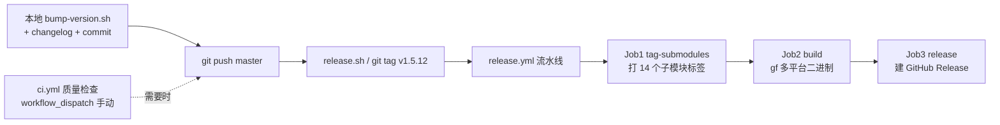

# 发布流程与注意事项

> 适用于 **多模块 Monorepo** 形态:主模块 + `cool` + `modules/*` + `contrib/*` + `cool-tools` + `docs` 共 15 个 Go 模块(`docs`/`frontend` 为 go1.18 辅助模块)。
> 目标:一次 `vX.Y.Z` 主标签触发,**自动**完成子模块打标、`cool-tools` 多平台二进制构建、GitHub Release 发布。
> 质量检查(`ci.yml`)已改为**手动触发**,不再作为自动门禁阻塞发版(原因见 §五.15)。

---

## 一、发布体系构成



| 文件 | 作用 | 何时运行 |
|---|---|---|
| `.github/workflows/ci.yml` | 质量检查:go.work 下**逐模块** `go build` + `go vet`(内容不变,仅触发方式调整) | 手动 `workflow_dispatch`(自动触发已停用,见 §五.15) |
| `.github/workflows/release.yml` | 发版流水线(3 个 Job,见下) | 推送 `v*` 标签 |
| `scripts/bump-version.sh` | 发布前统一版本号(见 §四.1) | 本地,发布前 |
| `release.sh` | 检查分支/工作区后 `git push origin master` + 打主标签 | 本地,发布时 |
| `pre-release.sh` | 旧版打包脚本:同步 `binVersion` + `yarn docs:deploy`(推 gh-pages 文档站)+ 本地 `make pack.*` | 本地,**需要文档站更新时** |
| `gowork.sh` / `gotidy.sh` | 本地生成 `go.work` / 逐模块 `go get -u && tidy` | 本地开发 |
| `docs/changelog.md` | 版本更新日志,Release Notes 自动截取顶部最新小节 | 发布前人工维护 |

> `autotag.yml` 已删除:子模块打标统一收敛到 `release.yml` 的 Job1,避免两个 workflow 并发推标签的竞态。

---

## 二、标准发布流程(推荐)

### 前置条件
- 在 **master** 分支,工作区干净(有未提交改动时 `release.sh` 会拒绝;Codespace 环境自动跳过该检查)。
- 本地 Go ≥ **1.23.0**(与各模块 `go.mod` 的 `go 1.23.0` 指令一致;仓库要求见 §五.8)。

### 步骤(以 `v1.5.12` 为例)

```bash
# 0) 更新依赖(可选)并本地验证
#    有 go.mod 版本变更时建议先:
#    bash gowork.sh && go build ./... && go vet ./... && rm -f go.work go.work.sum

# 1) 统一版本号:自动改写 cool-tools 的 binVersion + 所有 go.mod 的内部依赖版本
bash scripts/bump-version.sh v1.5.12

# 2) 在 docs/changelog.md 顶部新增小节(格式见 §五.5):
#    ## 1.5.12
#    - 本次变更说明...

# 3) 人工 review 改动并提交推送
git diff
git add -A
git commit -m "v1.5.12: ...变更说明..."
git push origin master   # 推送提交(ci.yml 已改手动触发,不会自动执行)

# 4) 打主标签触发发版(会再次 push master 并创建 v1.5.12)
./release.sh v1.5.12
```

### 推送标签后 Actions 自动完成

1. **ci.yml**:已改为手动触发——master push / PR 不再自动执行(见 §五.15);需要全量 build+vet 时在 Actions 页手动 Run workflow。
2. **release.yml Job1 `tag-submodules`**:为每个含 `go.mod` 的目录打子模块标签,例如
   `cool/v1.5.12`、`modules/base/v1.5.12`、`contrib/drivers/mysql/v1.5.12`、`cool-tools/v1.5.12`、`docs/v1.5.12`…(已存在的标签自动跳过,幂等)。
3. **Job2 `build`**:安装固定版 `gf` CLI(`go install github.com/gogf/gf/cmd/gf/v2@<GF_VERSION>`),初始化 `go.work`,执行 `make pack.template-simple` + `make pack.docs` 内嵌脚手架/文档资源,`gf build` 产出多平台二进制并统一命名。
4. **Job3 `release`**:下载二进制,从 `docs/changelog.md` 截取最新小节作为 Release Notes,创建 GitHub Release(附件:`cool-tools_linux`、`cool-tools_darwin`、`cool-tools_windows.exe` 等)。

> ⚠️ 子模块标签形如 `modules/base/v1.5.12`,**不以 `v` 开头**,不匹配 `release.yml` 的 `v*` 触发器 → 不会递归触发发版。

---

## 三、分场景选择

| 场景 | 要做什么 |
|---|---|
| 常规发版(代码 + 二进制 + Release) | 走 §二 完整流程 |
| **附带文档站更新**(vuepress gh-pages) | 在 push 前额外执行 `bash pre-release.sh v1.5.12`(它同步 `binVersion` 并 `yarn docs:deploy` 推送 gh-pages,供 release.yml Job2 的 `pack.docs` 抓取) |
| 仅安全修复、不发 `cool-tools` | 同样打主标签即可;若某子模块本次无任何变更仍会被打标(所有含 go.mod 的目录都打),属预期行为 |
| PR 阶段 | 无自动门禁;需要检查时在 Actions 页手动 Run `ci.yml`(workflow_dispatch) |

> `cool-tools` 的资源打包(`pack.template-simple` / `pack.docs`)与 `docs:deploy` 需要**联网**克隆 `cool-team-official/cool-admin-go` 的 `simple` / `gh-pages` 分支;CI 内用 https,本地脚本默认 ssh(Codespace 自动切 https)。

---

## 四、本地脚本说明

### 1. `scripts/bump-version.sh`(发布前必跑)
多模块仓库最大的坑是**版本号散落多处**。此脚本一次性把:
- `cool-tools/internal/cmd/version.go` 的 `binVersion` → 新版本;
- **所有** `go.mod`(根 + 全部子模块,含 `docs`/`frontend`)中 `github.com/cool-team-official/cool-admin-go/...` 内部依赖版本 → 新版本;

替换规则只命中 require 行的版本号,**不误改 `module` 声明行**。用法:

```bash
bash scripts/bump-version.sh v1.5.12   # 版本必须满足 vMAJOR.MINOR.PATCH
```

> 内部依赖版本必须与新版本一致,否则外部用户 `go get` 拉到的是旧子模块 tag(历史遗留:主标签曾为 v1.5.11 而内部 require 仍是 v1.5.10,属需要避免的错位)。

### 2. `release.sh`(打标签入口)
- 校验在 master、无未提交改动、tag 为语义化版本后:
  `git push origin master` → `git tag v1.5.12` → `git push origin v1.5.12`。

### 3. `pre-release.sh`(仅本地,需要文档站时)
历史脚本,用于**发版前**把脚手架/文档资源打进 `cool-tools` 并把新版文档发布到 gh-pages。CI 的 Job2 已能在构建时自动 `pack`(抓取已发布的 gh-pages/simple 分支),因此常规流程**不需要**跑它;只有"本次变更包含文档站内容,gh-pages 需要先更新"时才先执行它(或直接手动推 gh-pages)。

---

## 五、注意事项与常见坑

1. **主标签必须是语义化版本** `vMAJOR.MINOR.PATCH`(如 `v1.5.12`)。Job1 对非语义化标签(如 `v1.5.12-rc1`)会跳过子模块打标,但 Job2/3 仍会构建发版——**此时外部 go get 解析不到子模块新版**。
2. **子模块标签命名**:`<go.mod 所在目录>/<版本>`。依赖目录层级,`find contrib modules cool cool-tools docs -name go.mod` 自动推导,新增/删除子模块无需改 workflow。
3. **打错标签的补救**:先删主标签,再删所有已推的子模块标签,否则 Job1 检测到标签已存在会**跳过**(不会指向新 commit):
   ```bash
   git tag -d v1.5.12 && git push origin :refs/tags/v1.5.12
   git ls-remote --tags origin | grep '1\.5\.12'   # 逐个删除 dir/v1.5.12
   ```
4. **`GF_VERSION` 环境变量**(`release.yml` env)必须与 `go.mod` 中的 gf 版本一致。当前为 **v2.10.3**,升级 gf 时两处同步改。
5. **changelog 格式约束**:`docs/changelog.md` 顶部必须是本次版本小节,以 `## x.y.z` 开头;Job3 用 `awk` 截取**第一个** `## ` 小节作为 Release Notes,因此不要把"更新日志"说明文字放在最新小节之前,小节内首行不要用 `##`。
6. **`go.work` 不入库**:CI 现场 `go work init && go work use -r .`,本地用 `gowork.sh`,验证完删掉 `go.work` / `go.work.sum`。多模块仓库**必须**在 workspace 下构建,否则各模块会去远端拉 require 里锁定的旧版内部依赖(当前为已发布版本),测不到工作区新代码。
7. **`cool` 等库模块单独 `go build`(脱离 workspace)失败是设计而非 bug**:`cool/initdb.go` 空导入 `contrib/drivers/{mysql,pgsql,sqlite}` 做驱动注册,但 `cool/go.mod` 不声明它们——驱动由**最终宿主应用**(根模块)在其 go.mod 中提供。workspace 内编译一切正常;若要把 `cool` 变回"可独立 `go get` 即编译"的库,需将驱动空导入移出库本体或加 build tag,并让根模块显式声明依赖。
8. **Go 版本要求为 go1.23.0**:gf v2.10.3 要求 go1.23.0,13 个模块 `go.mod` 的 `go` 指令已同步提升(删除了旧 `toolchain go1.22.1`)。`docs`/`frontend` 无 gf 依赖,保持 go1.18 不受影响。CI 用 `setup-go` + `go-version-file: go.mod` 自动装对应版本;本地成员工具链过低时 Go 会按 `GOTOOLCHAIN=auto` 自动下载。
9. **刻意保守的依赖版本**:`gorm.io/driver/postgres` 锁 **v1.6.0**(v1.6.1+ 需 go1.25)、`minio-go/v7` 锁 **v7.0.97**(v7.0.98+ 需 go1.24/1.25)。若愿意把 go 指令抬到 go1.25 可再升满,否则升级依赖时不要越过这两个版本。
10. **Actions 版本均为 Node20 系**:`checkout@v4`、`setup-go@v5`、`upload-artifact@v4`、`download-artifact@v4`、`softprops/action-gh-release@v2`。旧工作流死于 Node12 Action 与已废弃的 Releases upload API,勿回退。
11. **权限**:`release.yml` 声明 `permissions: contents: write`(推标签 + 建 Release 必需);`ci.yml` 只读。仓库若默认禁用 Actions 写权限,勿删除该声明。
12. **并发**:`ci.yml` 按 ref 设 `concurrency` 取消旧运行;同一次 `release.yml` 的 Job 按依赖链串行(打标 → 构建 → 发布),顺序保证子模块标签先于 Release 存在。
13. **产物命名**:`cool-tools_<os>`,Windows 为 `cool-tools_<os>.exe`,归一化在 `cool-tools/temp` 下完成;`fail_on_unmatched_files: true` 保证一个产物都不缺才发布。
14. **发布即最终**:GitHub Release 一旦创建即公开可见。先确认 Job1/Job2 全绿(可在 Actions 页查看 tag 对应运行)再放心;若构建失败可修正后**重打标签**再推(见第 3 条)。
15. **`ci.yml` 自 v1.5.12 起改为手动触发**:历史教训是 bump 提交把内部依赖升到新版本(如 v1.5.12)时,子模块同名 tag 要等 release.yml Job1 打主标签后才创建——若 master push / PR 自动跑构建,必然 `unknown revision .../v1.5.12` 而红,门禁既挡不住发布还制造噪音。现仅保留 `workflow_dispatch` 手动入口(jobs 内容不变):需要全量 build+vet 时在 Actions 页手动 Run(子模块 tag 就绪后即可全绿);若想恢复自动门禁,把 `on:` 加回 `push`(`master`)/`pull_request` 即可。
