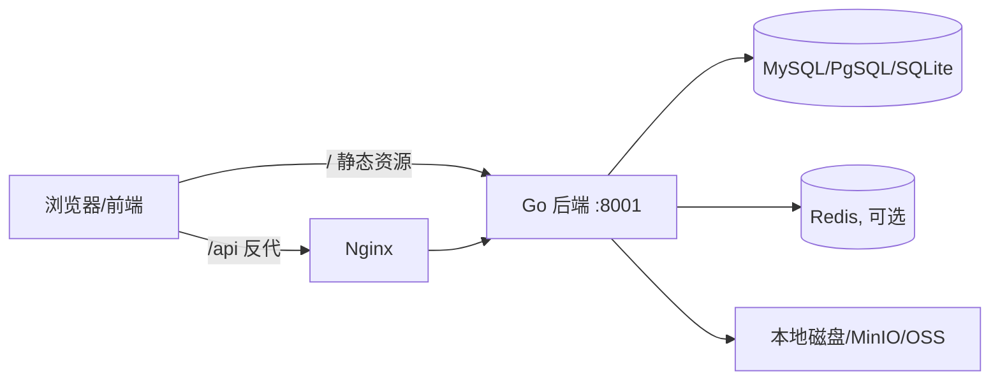

# 部署

[返回目录](README.md)

::: tip 提示
`CoolAdminGo` 是 **Go 单二进制 + 前端静态资源** 的经典架构。后端编译后是一个可执行文件（前端已打包进二进制时还能直接托管页面），数据库用 MySQL/PostgreSQL/SQLite 之一，缓存可选用 Redis（集群/分布式函数需要）。
:::

## 一、架构一览



- 后端 HTTP 服务默认监听 `:8001`，配置见 `manifest/config/config.yaml` 的 `server` 节；
- 前端构建产物 `frontend/dist` 若存在会被设为**静态资源根目录**（`internal/cmd/cmd.go`），可直接用后端托管；
- 也可用 Nginx 托管前端并反代 `/api`（参考 `frontend/nginx.conf`）。

## 二、编译后端

```bash
# 在仓库根目录(多模块需先整理依赖;详见 docs 开发工具/RELEASE 说明)
go build -o cool-admin-go main.go

# 或使用开发模式直接运行
gf run main.go

# 交叉编译(Linux amd64)
CGO_ENABLED=0 GOOS=linux GOARCH=amd64 go build -o cool-admin-go-linux-amd64 main.go
```

::: warning 注意
本仓库是 **Go 多模块 monorepo**（`cool/`、`modules/*/`、`contrib/*` 各自独立 go.mod）。在根目录构建前请先 `go mod tidy`（必要时按 `RELEASE.md` 用 `go work` 联调）。发布/打包细节见仓库内 `RELEASE.md`。
:::

## 三、配置生产参数

编辑 `manifest/config/config.yaml`：

```yaml
server:
  address: ":8001"            # 生产改为具体监听
  clientMaxBodySize: "100MB"  # 上传大小上限

database:
  default:                    # 换成你的生产库
    type: "mysql"
    host: "127.0.0.1"
    ...
    name: "cooltest"

cool:
  autoMigrate: true           # 首次启动自动建表
  file:
    mode: "local"             # local | minio | oss
    domain: "https://你的域名"   # 上传文件访问域名
```

生产环境务必修改/强化：

| 项 | 说明 |
|---|---|
| JWT 密钥 | `modules.base.jwt.secret` 弱密钥会被自动替换为随机值,建议显式配置强随机串 |
| 数据库口令 | 不要用示例密码 |
| Redis 口令 | `redis.cool` 配置;无密码时注释/删除相应配置即可 |
| 上传域名 | 指向最终公网可访问地址 |
| 时区 | 数据库、容器与 `server.timezone` 保持一致 |

## 四、前端部署

### 方式 A:后端托管(最简单)

```bash
cd frontend
yarn && yarn build    # 产出 dist
# 把 dist 放到后端工作目录的 frontend/dist 下,直接运行后端二进制即可访问
```

后端启动时检测到 `frontend/dist` 目录会自动作为站点根目录，并提供 `/i18n` 国际化文案接口。

### 方式 B:Nginx 托管(推荐生产)

参考 `frontend/nginx.conf`（仓库内前端工程自带，`midway:8001` 请替换为你的后端地址）：

```nginx
server {
  listen 80;
  location / {
    root   /app;                      # 前端 dist
    index  index.html;
    try_files $uri $uri/ /index.html; # Vue history 路由回退
  }
  location /api/ {
    proxy_pass http://你的后端:8001/;  # 反代后端,去掉 /api 前缀需与后端路径约定一致
    proxy_set_header Host $host;
    proxy_set_header X-Real-IP $remote_addr;
  }
}
```

::: tip 上传访问
若上传使用本地驱动,后端会注册 `/public` 静态目录,记得在 Nginx 放行 `/public/` 或改用 `cool.file.domain` 指向直出静态资源。
:::

## 五、Docker / Docker Compose 部署

仓库根目录自带 `docker-compose.yml`,提供一套开箱即用的基础服务(**全部 `network_mode: host`,便于本地联调**):

| 服务 | 镜像 | 默认端口 | 说明 |
|---|---|---|---|
| `mysql` | `mysql:8` | 3306 | 业务库 `cooltest`,root 密码 `123456` |
| `redis` | `redis` | 6379 | 缓存/分布式函数 |
| `pgsql` | `postgres` | 5432 | PostgreSQL(可选) |
| `etcd1..3` | `bitnami/etcd` | 12379/12380 | 测试用 etcd(如不需要可注释) |

```bash
docker compose up -d mysql redis   # 只启动需要的服务
docker compose ps                  # 查看状态
docker compose down                # 停止(数据保留在 ./data)
```

后端自身可打进镜像运行。参考 `frontend/Dockerfile` 思路:

```dockerfile
# 多阶段:先构建前端/后端,再拷贝进精简运行镜像
FROM nginx:alpine
COPY --from=frontend /app/frontend/dist /app
COPY --from=backend  /go/bin/cool-admin-go /app/
# ... 视编排注入 config.yaml 与环境变量
```

## 六、多副本与分布式

多实例部署时**必须启用 Redis**(配置 `redis.cool`),这样:

- `cool.IsRedisMode=true`,`cool.ListenFunc` 启动,分布式函数可跨实例调度(见[分布式函数](distributed_function.md));
- 定时任务不会重复触发(单例函数靠 `cool:masterflag` 选举主节点执行,见[定时任务](cron.md));
- 操作日志/权限缓存集中到 Redis,各实例共享。

后端无状态,前面加负载均衡即可;上传如需多实例共享,请把 `cool.file.mode` 切到 MinIO/OSS(见[文件上传](file_upload.md))。

## 七、常见运维

| 场景 | 做法 |
|---|---|
| 查看健康 | 浏览器访问 `:8001/` 或文档(swagger 默认 `/swagger`,OpenAPI `/api.json`) |
| 升级版本 | 停服 → 备份数据库 → 替换二进制 → 启动(自动建表/迁移) |
| 清缓存 | 删除 Redis 中 `cool:*` 键或重启(生产建议提供清理入口) |
| 数据备份 | 定期 `mysqldump` / pg_dump,上传目录一并备份 |

::: warning 安全提醒
- 生产不要开 `server.debug: true` 与调试接口;
- `swagger`/`openapiPath` 如不需要可关闭或加访问限制;
- 请务必为管理端用户使用强密码,并定期审计 `base_sys_log`。
:::
